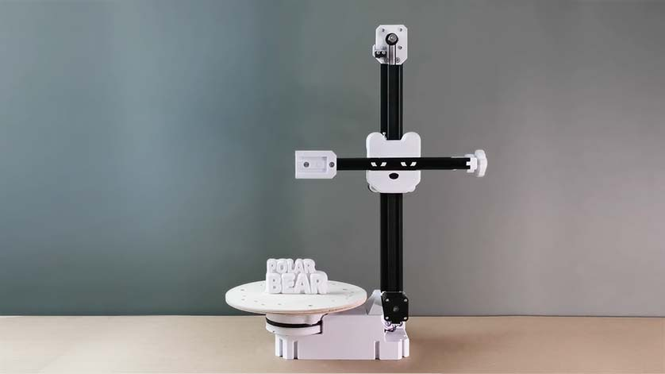

# the PolarBear
http://www.kadirilkimen.com/thepolarbear

# BOM OF THE PROTOTYPE IS LOADED.
# It is not the BOM of Version1.
### I'm still working on version1.
### I received a lot of requests for the BOM and decided to upload the BOM of the prototype.
#### Please use this as a reference and build the machine for familiarization only.
#### You may experience some problems during installation and/or use. But none of them are unsolvable.
#### Have fun!

>
> ### IMPORTANT
> #### All existing STL files and the design of the machine are still in development.
> Some parts will be updated for better printing and easier assembly.
>
>

the PolarBear needs support. I would appreciate any contribution to help with funding.
I will add any supporter's name/logo into the CREDITS documentation both in this repository and the website :
http://www.kadirilkimen.com/thepolarbear

## It is a multi-purpose CNC machine

* What is it?
  * It can be a 3d printer, a CNC milling machine, or whatever you think it can do.
  * It is not designed to be a complete replacement for existing machines.
  * It has different pros that other machines don't have.

* Some pros of other machines
  * A Cartesian 3d printer is vastly available and easy to access. Software works well with them.
  * A CNC router is good for working on large sheet materials.
  * A plotter/cutter machine is good and fast for drawing/cutting paper and foil.
  * Stock materials are mostly rectangular.

* Some pros of the PolarBear
  * In most cases it can work faster.
  * The rotary axis makes it possible to work on different surfaces of the workpiece, rather than just vertical ones.
  * It could easily have another function. It only takes a minute to switch between CNC milling and 3d printing.
  * Due to the different kinematics of the PolarBear, it moves more smoothly, which increases the precision and quality of the work.

## Main Goals

### Improving mechanical design

The current prototype works as expected. But some improvements are needed.

### Improving rigidity

The current design is rigid enough for most jobs. 3d printing, pens, wood burning works just fine without any flexing.

CNC milling is also good, but requires more rigid mechanics to get better.

### Making mechanical calibration easier

I need to improve the design to eliminate two calibration issues.

* I need to make it easy to align the tooltip to the absolute center of the rotary axis.

* I should make it easy to adjust the squareness of the vertical mast and the rotary axis.

### Making a scalable design

* Making a scalable design so that people can build the PolarBear in different sizes.

* I'm thinking to develop a laser cut sheet metal body version so people can build robust industrial machines of any size.

### A Custom Firmware

#### Do we need a custom firmware?

The current prototype runs on an off-the-shelf 3d printer controller with a Marlin based firmware. I've also done tons of experiments with an Arduino/Grbl CNC shield.
It just works great. However, since these off-the-shelf components and firmware don't know the PolarBear kinematics, I had to develop a postprocessor for g-codes:

https://github.com/kadirilkimen/polarToolsJS

This postprocessor imitates the polar movements that would be run by a cartesian controller. This works great too. But it is not efficient.
It generates twice or more g-codes and it cannot run the machine at efficient feed rates. Even if we calculate the best feed rates, the firmware will treat the movements as cartesian and recalculate the decelerations and accelerations, which would be wrong for polar motions.

Therefore, without special firmware for polar and cross slide motion, the machine often runs at inefficient feed rates.
Feed rates are still good. It's not just the best. So if you're looking for a quick, simple and good enough solution, an off-the-shelf controller is for you.

I am thinking to modify Grbl. It seems simpler to accomplish. Also, I'm sure a lot of people will use Grbl controller. Because it is very affordable and simple.
For more complicated firmware and controllers, I will need help.
When I develop Grbl based firmware for the PolarBear, it would become a blueprint for other developers and they can add kinematics to other firmware.

Current controller boards are good. However, in order to make them compatible with the quick-change tool adapter, people need to make modifications.
Which is not for everyone.

So the ultimate solution is to develop a custom controller board and custom firmware.
Fortunately, we don't have to invent them from scratch. There are some great open source projects to start with.

After all, the absence of a dedicated controller and firmware is not a bottleneck for the project.

### A Custom Cam software

#### Do we need a custom cam software?

Unfortunately, when it comes to a "cam software", I don't think there is a good open source solution. All they have flaws or lack of enough skills.
If I were to cite open source software as a successful "cam software", it would be Cura. Although it is a cam software, it is only for 3d printing.
There are good freeish cam softwares out there. However, they lack sufficient features or often push you to purchase services or subscriptions.
I think there is a lack of good open source CAM software in the world right now.
When I want to do a CNC related project, the lack of good open source cam software limits me a lot.
Often I have to solve the problem using zillions of apps and libraries. If I couldn't code, it would mostly be impossible.

There are people who do not code, have ideas and need cnc machines. It's time to fix this problem.

So an open source cam software is a must to develop.

It's not an issue directly related to the PolarBear project, but a good cam software familiar with the PolarBear will increase the efficiency of the machine.

### Universal Quick Change Tool adapter with an electronic interface

#### Why?

All 3d printers, CNC routers, CNC milling machines, plotters (... and tons of other stuff) are all CNC machines.

The difference between these machines is their functionality and construction.
Although all these machines can be modified to do the work of others, they cannot be efficient at functions they were not designed to do.
Because all different functions require different mechanical capacities and speeds.

Thanks to the PolarBear's unique design and kinematics, the limits between the needs of the different functions are more blurred.
While it can be as fast as a 3d printer, it can be rigid for use as a CNC milling machine as well.

The only clear limit is the PolarBear's work volume.

So why not use it as a multi-purpose machine?

## Funding the project

It takes full-time effort of more than one person to design a good machine and a good cam software.

Right now I'm funding and working on it just myself.

I look forward to more support and donations to go further and build a business around it.

With some support, I'll be able to finish the scalable mechanical design and start selling kits.

Then I think selling kits will finance the project and I will be able to focus on developing open source powerful cam software.
